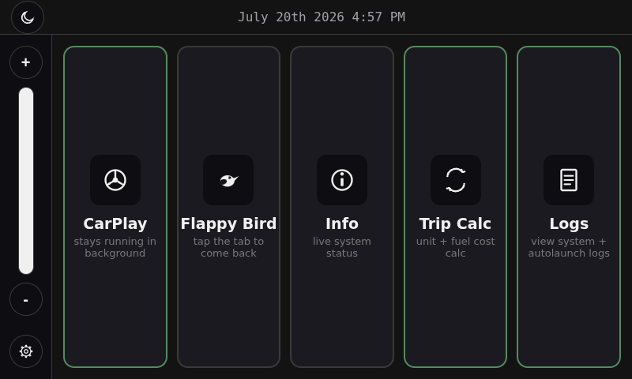
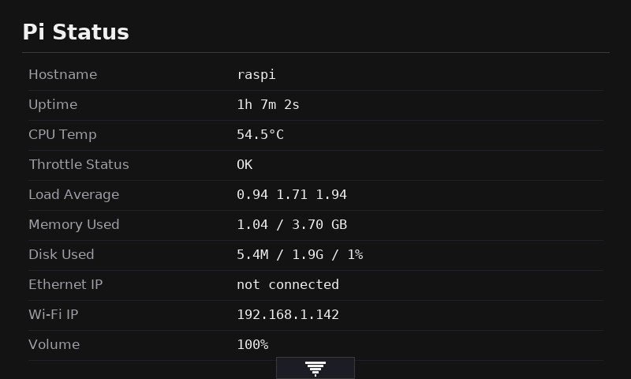
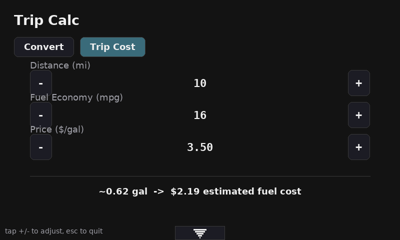
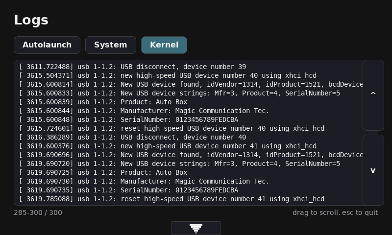
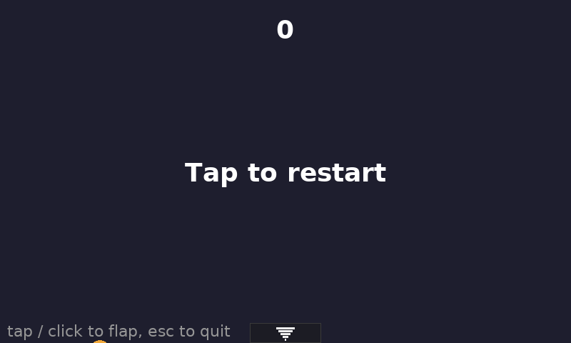

# carplay Pi


A Raspberry Pi 4 CarPlay dongle box, turned into a small touchscreen
home screen with CarPlay as one app among a few others.

## Screenshots

The home screen, live on the 800x480 touchscreen:



CarPlay, one tile among the others:


| Info (live system status) | Trip Calc (fuel cost) |
|---|---|
|  |  |

| Logs (on-screen tail) | Flappy Bird (touch test) |
|---|---|
|  |  |

## What's here

- **`launcher/`** — the Chromium-kiosk home screen (Python backend +
  HTML/CSS/JS frontend) that autostarts on boot. CarPlay, Flappy Bird,
  Info, Trip Calc, and Logs are all tiles on it, switchable by touch.
- **`pi-monitor/`** — an on-screen alert system (via `dunst`) for CPU
  temp warnings and IP-address notifications, since CarPlay runs
  fullscreen with no window chrome to show that otherwise.

## Quick start

Warning: Modifications will be needed in [pi-monitor/deploy.sh](launcher/deploy.sh) and [pi-monitor/deploy.sh](pi-monitor/deploy.sh) to make this work on your own Pi.

```sh
ssh [user]@raspi.local          # SSH in
cd launcher && ./deploy.sh     # deploy launcher changes
cd pi-monitor && ./deploy.sh   # deploy pi-monitor changes
```

The Pi's root filesystem is **read-only at runtime** — a plain SSH edit
gets reverted on reboot. The deploy scripts handle writing through to
the real partition correctly; don't skip them.

## Full documentation

See **[INFO.md](INFO.md)** for everything else: hardware quirks, the
read-only-root persistence model in detail, networking, SSH access,
how the launcher and pi-monitor actually work, known limitations, and
a full command reference.
