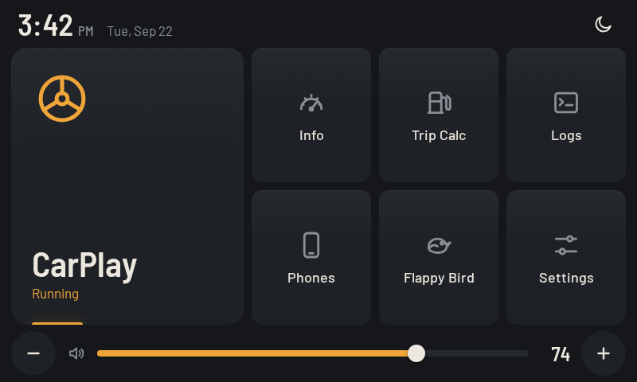
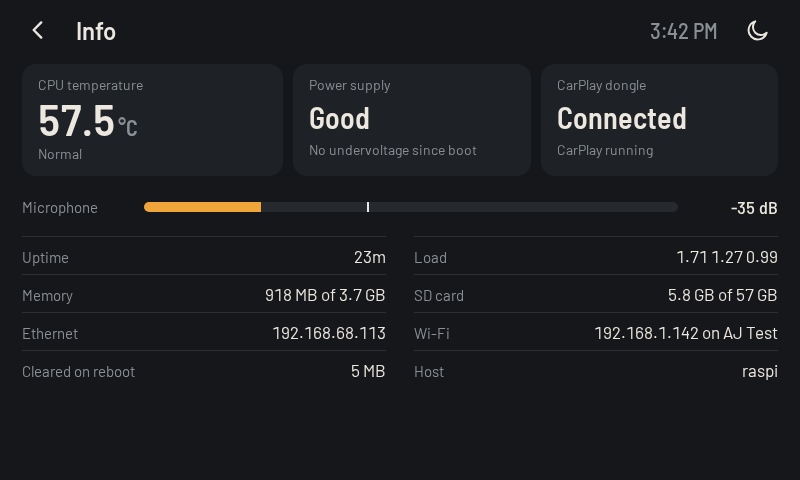
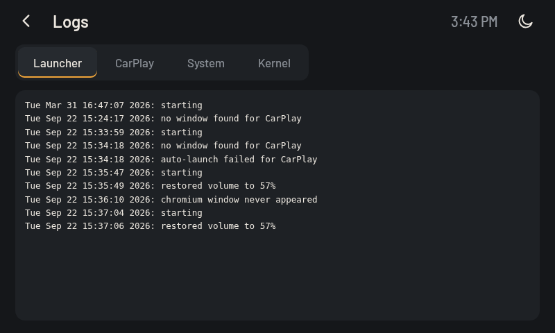
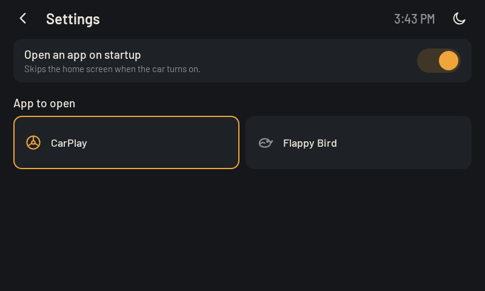

# carplay Pi

A Raspberry Pi 4 CarPlay dongle box, turned into a small touchscreen
home screen with CarPlay as one app among a few others.

## Screenshots

The home screen, live on the 800x480 touchscreen. CarPlay gets the big
tile; everything else is one tap away, and the whole UI is sized for a
finger at arm's length:



CarPlay, one tile among the others:


| Info (live system status) | Trip Calc (fuel cost) |
|---|---|
|  |  |

| Logs (on-screen tail) | Settings |
|---|---|
|  |  |

## What's here

- **`launcher/`**: the Chromium-kiosk home screen (Python backend +
  HTML/CSS/JS frontend) that autostarts on boot. CarPlay and Flappy Bird
  are separate apps it launches; Info, Trip Calc, Logs, Phones (the
  dongle's paired devices) and Settings are views inside the kiosk.
  Settings, trip values, volume and CarPlay's own config all survive
  reboots despite the read-only root.
- **`launcher/tools/`**: dongle tooling (web panel client, icon setter) and
  the react-carplay audio patch that fixes crackling.
- **`pi-monitor/`**: an on-screen alert system (via `dunst`) for CPU
  temp warnings and IP-address notifications, since CarPlay runs
  fullscreen with no window chrome to show that otherwise.

## Quick start

Warning: the deploy scripts assume user `ajxd2` on host `raspi.local`;
edit [launcher/deploy.sh](launcher/deploy.sh) and
[pi-monitor/deploy.sh](pi-monitor/deploy.sh) for your own Pi.

```sh
ssh [user]@raspi.local            # SSH in
(cd launcher && ./deploy.sh)      # deploy launcher changes
(cd pi-monitor && ./deploy.sh)    # deploy pi-monitor changes
(cd launcher && python3 server.py --dev)   # work on the UI locally at http://127.0.0.1:8734
```

The Pi's root filesystem is **read-only at runtime**: a plain SSH edit
gets reverted on reboot. The deploy scripts handle writing through to
the real partition correctly; don't skip them.

## Full documentation

See **[INFO.md](INFO.md)** for everything else: hardware quirks, the
read-only-root persistence model in detail, networking, SSH access,
how the launcher and pi-monitor actually work, known limitations, and
a full command reference.
